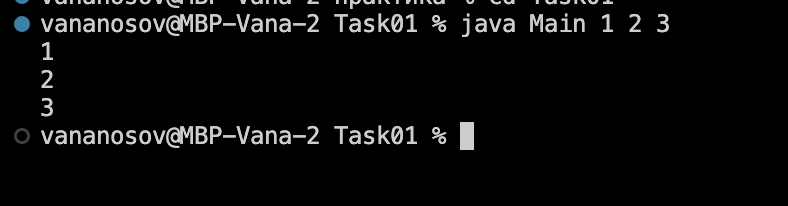
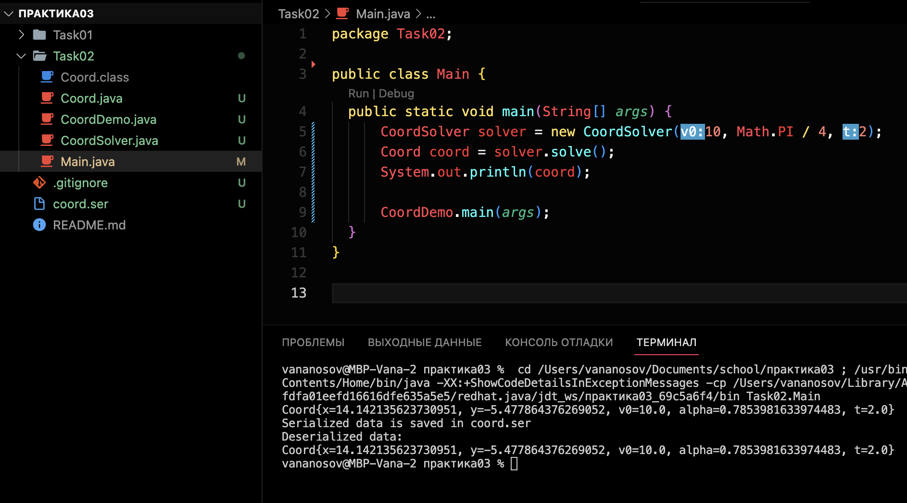
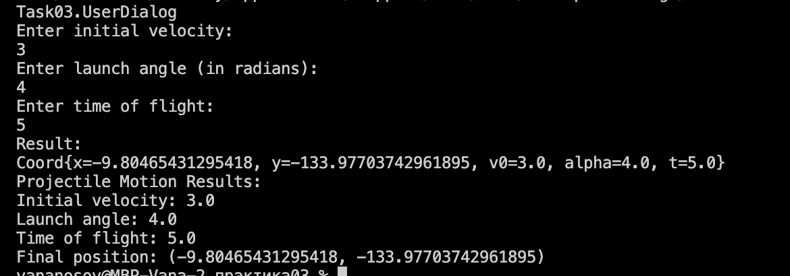
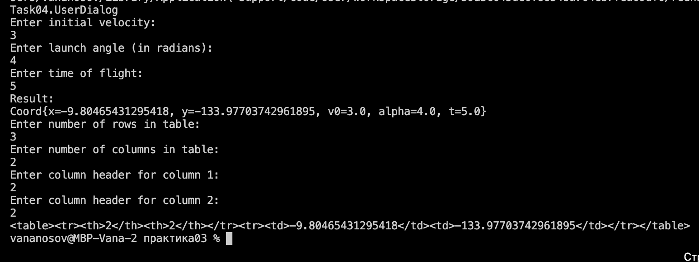
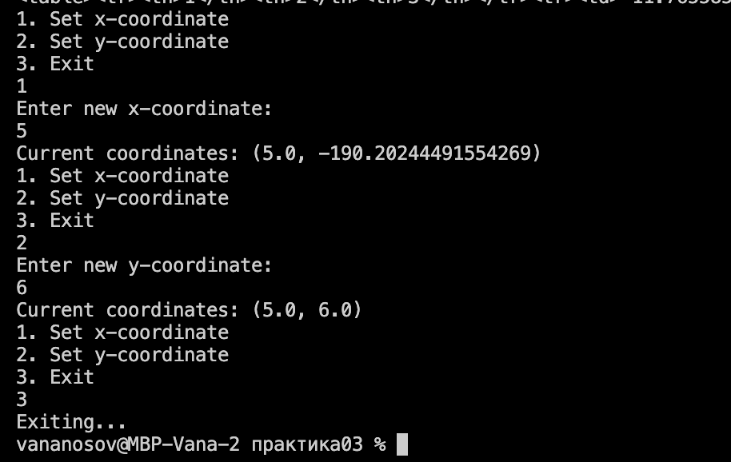
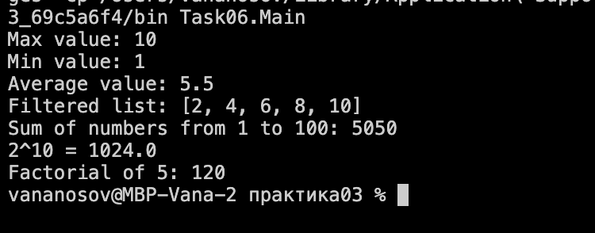

# 34_nosov_ivan

+ [TASK01](#TASK01)
+ [TASK02](#TASK02)
+ [TASK03](#TASK03)
+ [TASK04](#TASK04)
+ [TASK05](#TASK05)

## TASK01:
**Завдання:**

Виконати розробку найпростішої консольної програми на Java,
наприклад, що виводить на екран усі аргументи командного рядка, задані під час
під час запуску та розмістити її в локальному схови

#Результат запуску кода: 

## TASK02:
**Індивідуальне завдання:**

16.Визначити 16-річне подання цілісних значень координат (x = v0 * cos (α) * t;
y = v0 * sin (α) * t - (g * t * t) / 2) положення фізичного тіла при русі під дією
сили тяжіння.

**Завдання:**

- Розробити клас, що серіалізується, для зберігання параметрів і результатів
обчислень.
Використовуючи агрегування, розробити клас для знаходження рішення
задачі. 

- Розробити клас для демонстрації в діалоговому режимі збереження та
відновлення стану об'єкта, використовуючи серіалізацію. Показати особливості
використання transient полів

- Розробити клас для тестування коректності результатів обчислень та
серіалізації/десеріалізації.

#Результат запуску кода:

## TASK03:

**Завдання:**

- Як основа використовувати вихідний текст проекту попередньої лабораторної роботи. Забезпечити розміщення результатів обчислень уколекції з можливістю збереження/відновлення.
- Використовуючи шаблон проектування Factory Method (Virtual Constructor), розробити ієрархію, що передбачає розширення рахунок додавання
нових відображуваних класів.
- Розширити ієрархію інтерфейсом "фабрикованих" об'єктів, що представляє набір методів для відображення результатів обчислень.
- Реалізувати ці методи виведення результатів у текстовому виде.
- Розробити тареалізувати інтерфейс для "фабрикуючого" методу.

#Результат запуску кода: 

## TASK04:

**Завдання:**

- За основу використовувати вихідний текст проекту попередньої лабораторної роботи Використовуючи шаблон проектування Factory Method
(Virtual Constructor), розширити ієрархію похідними класами, реалізують методи для подання результатів у вигляді текстової
таблиці. Параметри відображення таблиці мають визначатися користувачем.
- Продемонструвати заміщення (перевизначення, overriding), поєднання (перевантаження, overloading), динамічне призначення методів
(Пізнє зв'язування, поліморфізм, dynamic method dispatch).

#Результат запуску кода: 

## TASK05:

**Завдання:**

- Реалізувати можливість скасування (undo) операцій (команд).
- Продемонструвати поняття "макрокоманда".
- При розробці програми використовувати шаблон Singletone.
- Забезпечити діалоговий інтерфейс із користувачем.

#Результат запуску кода: 

## TASK06:

**Завдання:**

- Продемонструвати можливість паралельної обробки елементів колекції (пошук мінімуму, максимуму, обчислення середнього значення, відбір за критерієм, статистична обробка тощо).
- Управління чергою завдань (команд) реалізувати за допомогою шаблону Worker Thread.

#Результат запуску кода: 

